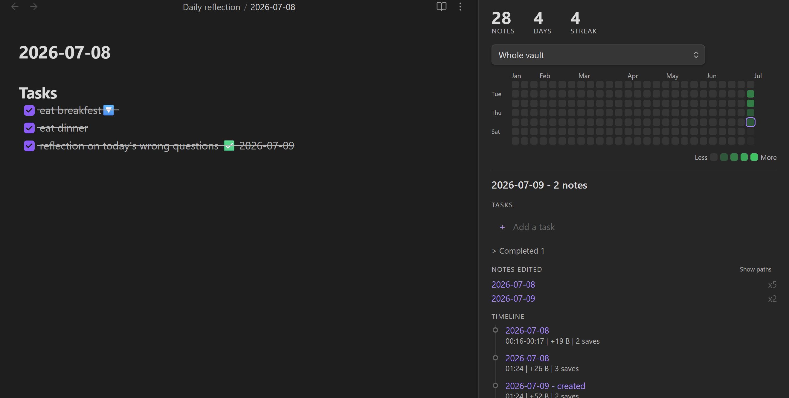
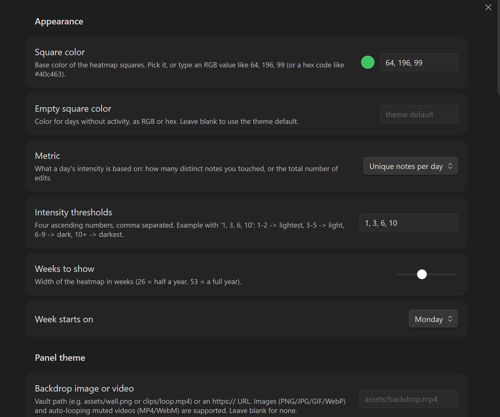
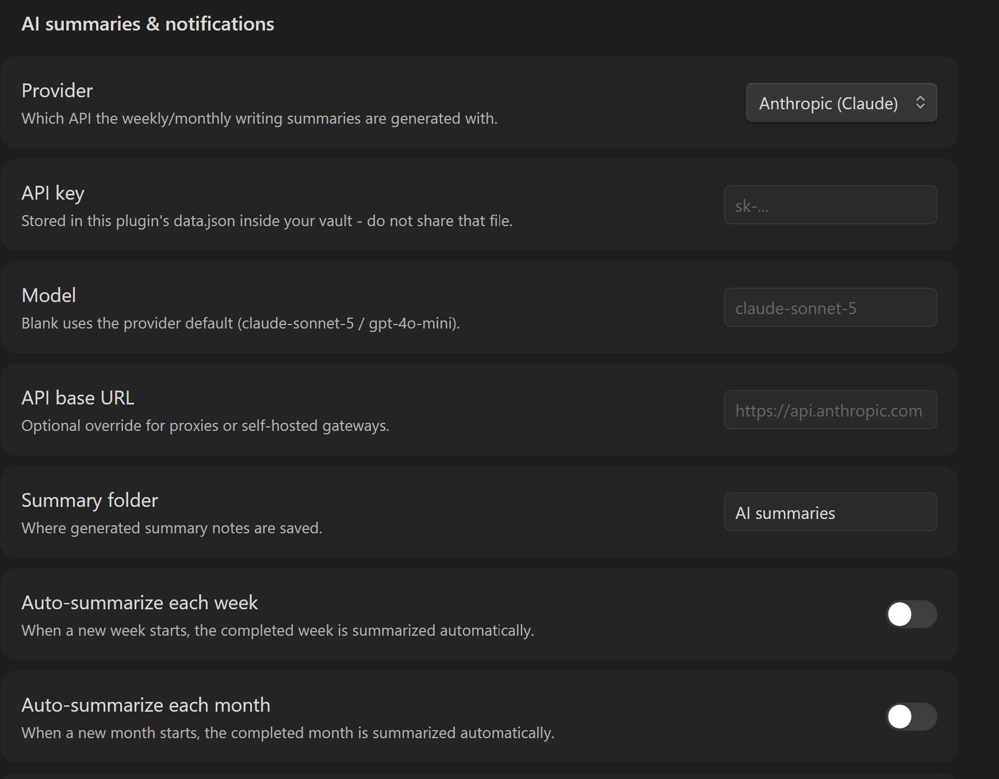

# Vault Activity Heatmap

[](https://obsidian.md)
[](https://github.com/AndrewRao114/vault-activity-heatmap/releases)
[](https://github.com/AndrewRao114/vault-activity-heatmap/releases)
[](LICENSE)

A GitHub-style contribution graph for your Obsidian vault, with daily tasks,
edit timelines, AI weekly/monthly summaries, and a customizable panel theme.

It turns your note-taking rhythm into a quiet activity dashboard: touch one note
and the day lights up faintly; work across a folder or ten notes and the square
gets darker. Click a day to see what changed, what you planned, and what still
needs attention.

## Screenshots

### Heatmap and day detail



### Appearance settings



### AI summaries and notifications



## Highlights

- **Daily activity heatmap** - one square per day, darker when you write more.
  View the whole vault or filter to one folder.
- **Automatic markdown tracking** - records notes created or edited per day,
  with rename/move support.
- **Day detail panel** - click a square to see tasks, notes edited, and a
  timestamped edit timeline.
- **Clean note labels** - notes show as short file names by default, with a
  one-click "Show paths" toggle when you need the full directory.
- **Microsoft To Do-style tasks** - add and complete tasks from the panel; the
  source of truth stays in your daily reflection note as markdown checkboxes.
- **Edit sessions** - rapid saves to the same note are merged into short
  sessions such as `14:31-14:45 | +240 B | 6 saves`.
- **AI weekly/monthly summaries** - bring your own Anthropic or OpenAI-compatible
  API key and summarize each week or month into a note.
- **Desktop and phone notifications** - desktop notifications locally, plus
  optional phone/webhook pings through ntfy or any compatible endpoint.
- **Panel-only themes** - customize this plugin without changing your Obsidian
  theme: RGB square colors, text/background overrides, image backdrops, and
  looping MP4/WebM video backdrops.

## Installation

### From Obsidian Community Plugins

This plugin is being prepared for the official Obsidian community directory.
Once approved, install it from:

`Settings -> Community plugins -> Browse -> Vault Activity Heatmap`

### Manual install

1. Download the latest release from
   [Releases](https://github.com/AndrewRao114/vault-activity-heatmap/releases).
2. Copy these files into:
   `<your vault>/.obsidian/plugins/vault-activity-heatmap/`
   - `manifest.json`
   - `main.js`
   - `styles.css`
3. Restart Obsidian or reload community plugins.
4. Enable **Vault Activity Heatmap**.
5. Run **Backfill history from existing file dates** if you want existing notes
   to appear immediately.

## Usage

Open the heatmap from the ribbon calendar icon or run:

`Open activity heatmap`

Click any square to inspect that day. Right-click a square to add a task to that
day's reflection note. The rest of the current week can also receive planned
tasks, which makes the heatmap useful as a lightweight planner, not only a log.

## Settings

### Tracking

- Choose whether intensity uses distinct notes or total edits.
- Set activity thresholds such as `1, 3, 6, 10`.
- Exclude folders like templates, archives, or attachments.
- Choose the number of weeks shown and the week start day.

### Daily reflection tasks

- Configure the reflection folder.
- Configure the filename date format, such as `YYYY-MM-DD`.
- Configure the heading where tasks are inserted.
- Toggle task and timeline sections in the detail panel.

### AI summaries

AI summaries are optional and require your own API key.

Supported providers:

- Anthropic
- OpenAI-compatible endpoints

The plugin gathers edited-note excerpts and activity stats, then writes weekly
or monthly summaries into your vault. It does not upload your whole vault; it
only sends the context needed for the requested summary.

Important: API keys are stored in the plugin's `data.json` inside your vault.
Do not share that file.

### Panel themes

Customize only this plugin panel, without changing your Obsidian theme:

- RGB/hex heatmap square color
- Empty-square color
- Panel text color
- Panel background color
- Image backdrop from a vault path or URL
- Looping muted MP4/WebM backdrop
- Dim and blur controls for readability

## Privacy

By default, tracking is local and stored in:

`.obsidian/plugins/vault-activity-heatmap/data.json`

The plugin records activity metadata such as dates, note paths, edit counts,
session times, and byte deltas. It does not store full note snapshots.

AI summaries send selected note excerpts to the provider you configure. If you
do not configure AI summaries, no AI API calls are made.

## Development

```bash
npm install
npm run dev
npm run build
npm run typecheck
```

Release assets are the three compiled plugin files:

- `manifest.json`
- `main.js`
- `styles.css`

## Roadmap

- Additional summary providers
- Optional summary templates
- Better mobile-specific layout tuning

## License

MIT. See [LICENSE](LICENSE).
